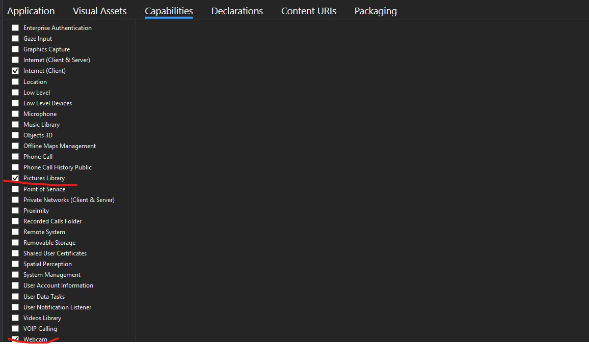
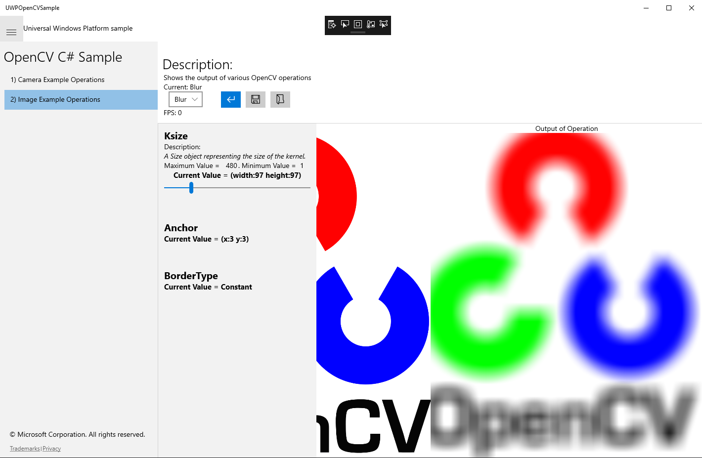

# UWPOpenCVSample
A simple tool to test opencv algorithms and adjust the parameters.

## Prerequisite

- VS 2017
- Build SDK 17763

## How to use it

Open the .sln file with VS 2017 and build it (debug with x64/x86).

configure the package.appxmanifest file with blow to set Capabilities

Scenario 1 use your web-camera to process with OPENCV

Scebarui 2 pick an image file to process with OPENCV

Finished feature: 
- Blur
- Houghlines
- Contours
- Canny

Ongoing feature:
- motion
- ...

## How to add custom feature

ongoing
